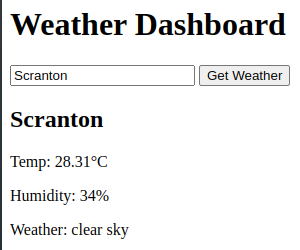

# 🌦️ Weather Dashboard

A simple weather dashboard web app built with **Node.js**, **Express**, and the **OpenWeatherMap API**. Search any city and view current weather conditions, including temperature, humidity, and description.

## 🚀 Features

- Search by city name
- Fetch current weather data from OpenWeatherMap
- Display temperature, humidity, and weather description
- Node.js backend with Express to handle API calls securely
- Frontend built with HTML, CSS, and JavaScript
- Responsive and minimal UI

## 🖼️ Demo

> Add a live link here once deployed (e.g., Render, Railway, etc.)

 <!-- Add a screenshot of your app -->

## 📁 Project Structure

```text
weather-dashboard/
├── commands.txt
├── package.json
├── public
│   ├── index.html
│   └── script.js
├── README.md
└── server.js
```

## 🔧 Installation & Setup

1. **Clone the repo**
   git clone https://github.com/your-username/weather-dashboard.git
   cd weather-dashboard

2. **Install dependencies**
    npm install

3. **Create a .env file in the root directory**
    WEATHER_API_KEY=your_openweathermap_api_key

4 **Run the app**
    node server.js

5 **Visit in browser**
    http://localhost:3000

## 🌐 API Reference

Using OpenWeatherMap API:

Current weather endpoint:
https://api.openweathermap.org/data/2.5/weather?q={city}&appid={API key}&units=metric

## 📦 Dependencies

- Express
- Axios
- dotenv

## 📌 To Do

- [ ] Add 5-day forecast
- [ ] Style with Tailwind or Bootstrap
- [ ] Implement geolocation search
- [ ] Add error handling UI

## 📄 License

This project is open source and available under the MIT License.